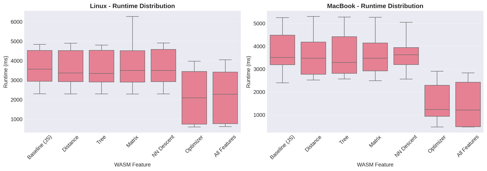

# UMAP-WASM: WebAssembly-Accelerated UMAP for JavaScript

[](LICENSE)

> **⚠️ Thesis Project Notice**: This library was developed as part of a master's thesis research project and is **not actively maintained**. While functional and tested, it is provided as-is for academic and experimental purposes. 



*Performance comparison across different machines. The baseline represents the pure JavaScript implementation (umap-js), while UMAP-WASM shows the WebAssembly-accelerated version. Note: The MacBook is approximately 5 years newer and more performant hardware compared to the Linux machine.*

A high-performance implementation of Uniform Manifold Approximation and Projection (UMAP) for JavaScript environments, featuring selective WebAssembly acceleration for compute-intensive operations.

## 📦 Installation

```bash
npm install umap-wasm
# or
yarn add umap-wasm
```

### Make the WASM artifacts available in the browser

For browser usage, WASM files must be served as static assets. The package includes pre-built WASM artifacts in `wasm/pkg/web/`. If your bundler doesn't automatically copy files from `node_modules`, add a postinstall script:

```json
{
  "scripts": {
    "postinstall": "mkdir -p public/wasm && cp -r node_modules/@elarsaks/umap-wasm/wasm/pkg/web public/wasm/"
  }
}
```

Adjust the destination to match your framework:
- Vite/React: `public/wasm/`
- Next.js: `public/wasm/`
- SvelteKit: `static/wasm/`

The WASM loader will look for files at `/wasm/web/umap_wasm_core.js` and `/wasm/web/umap_wasm_core_bg.wasm`.

Node.js environments don't require this step.

## Reproducible WASM build (short note)

If you need to rebuild the WASM artifacts locally, use the locked toolchain and skip post-build optimization to avoid runtime issues with externref tables. Recommended minimal steps:

- Ensure the repository `rust-toolchain.toml` is respected (Rust 1.83.0).
- Use `wasm-pack 0.13.1` and Node.js `22.22.0`.
- Build with `--no-opt` to skip `wasm-opt` (example):

```bash
cd wasm
RUSTFLAGS='-C target-feature=+simd128' wasm-pack build --no-opt --target web --out-dir pkg/web --release
RUSTFLAGS='-C target-feature=+simd128' wasm-pack build --no-opt --target nodejs --out-dir pkg/node --release
```

Skipping `wasm-opt` avoids a post-processing pass that may break WebAssembly externref table handling; it yields larger but correct binaries. Only publish optimized binaries after ensuring they pass the full test-suite.

## 🚀 Usage

### Basic Usage (Synchronous)

```javascript
import { UMAP } from 'umap-wasm';

const umap = new UMAP({
  nComponents: 2,
  nNeighbors: 15,
  minDist: 0.1
});

const embedding = umap.fit(data);
```

### WASM loading with progress

For progress tracking during WASM module loading:

```typescript
import { initWasm } from 'umap-wasm';

await initWasm({
  wasmUrl: '/wasm/web/umap_wasm_core_bg.wasm',
  onProgress: ({ percent, phase }) => {
    console.log(`WASM ${phase}: ${percent ?? 0}%`);
  }
});
```

### Asynchronous Fitting with Progress Tracking

```javascript
import { UMAP } from 'umap-wasm';

const umap = new UMAP();
const embedding = await umap.fitAsync(data, epochNumber => {
  console.log(`Epoch ${epochNumber} complete`);
  // Return false to stop early if needed
  return true;
});
```

### Step-by-Step Fitting

For fine-grained control over the optimization process:

```javascript
import { UMAP } from 'umap-wasm';

const umap = new UMAP();
const nEpochs = umap.initializeFit(data);

for (let i = 0; i < nEpochs; i++) {
  umap.step();
  // Update UI, check convergence, etc.
}

const embedding = umap.getEmbedding();
```

### Supervised Projection

Use label information to guide the embedding:

```javascript
import { UMAP } from 'umap-wasm';

const labels = [0, 0, 1, 1, 2, 2]; // Category labels for each data point
const umap = new UMAP();
umap.setSupervisedProjection(labels);
const embedding = umap.fit(data);
```

### Transforming New Points

Project additional data points into an existing embedding space:

```javascript
import { UMAP } from 'umap-wasm';

const umap = new UMAP();
const embedding = umap.fit(trainingData);

// Transform new points into the same embedding space
const newEmbedding = umap.transform(newData);
```

## 🔧 Configuration Parameters

The UMAP constructor accepts a `UMAPParameters` object with the following options:

| Parameter | Type | Default | Description |
|-----------|------|---------|-------------|
| `nComponents` | `number` | `2` | Target dimensionality of the embedding |
| `nNeighbors` | `number` | `15` | Number of nearest neighbors for manifold approximation |
| `nEpochs` | `number` | *auto* | Number of optimization iterations (computed if not specified) |
| `minDist` | `number` | `0.1` | Minimum distance between embedded points |
| `spread` | `number` | `1.0` | Effective scale of embedded points |
| `random` | `() => number` | `Math.random` | PRNG for reproducibility |
| `distanceFn` | `DistanceFn` | `euclidean` | Distance metric for input space |
| `useWasmDistance` | `boolean` | `false` | Use Rust/WASM distance functions (Euclidean, cosine, etc.) |
| `useWasmNNDescent` | `boolean` | `false` | Use Rust/WASM NN-Descent for nearest neighbor graph refinement |
| `useWasmTree` | `boolean` | `false` | Use Rust/WASM random projection trees for neighbor search |
| `useWasmMatrix` | `boolean` | `false` | Use Rust/WASM sparse matrix operations |
| `useWasmOptimizer` | `boolean` | `false` | Use Rust/WASM gradient descent optimizer |

**WASM Performance Note**: Enable WASM features for improved performance on large datasets (1000+ points). For small datasets, JavaScript may be faster due to overhead.

### Example Configuration

```typescript
import { UMAP } from 'umap-wasm';

// Basic 2D embedding
const umap = new UMAP({
  nComponents: 2,
  nNeighbors: 15,
  minDist: 0.1
});

// 3D embedding with WASM acceleration
const umapWasm = new UMAP({
  nComponents: 3,
  nNeighbors: 30,
  useWasmDistance: true,
  useWasmNNDescent: true,
  useWasmOptimizer: true
});
```
--- 

## 📚 Academic Context

This project is part of a master's thesis:

**Title:** *WebAssembly-Accelerated UMAP for Browser Environments*  
**Author:** Elar Saks  
**Institution:** Tampere University of Applied Sciences (TAMK)  
**Year:** 2026

### Research Objectives

The thesis investigates hybrid JavaScript/WebAssembly architectures for scientific computing in browsers, specifically:

- **Performance Analysis**: Quantifying speedup gains from selective Rust/WASM compilation of hot-path computational kernels
- **Interoperability Patterns**: Evaluating efficient data marshalling between JavaScript and WebAssembly memory spaces
- **Practical Implementation**: Maintaining API compatibility while optimizing performance-critical components
- **Trade-off Analysis**: Assessing development complexity, bundle size, and runtime performance improvements

## 🎯 Overview

Uniform Manifold Approximation and Projection (UMAP) is a dimension reduction technique used for visualization and general non-linear dimension reduction, offering advantages over t-SNE in speed and preservation of global structure.

This implementation builds upon the upstream `umap-js` library with strategic WebAssembly optimizations for:
- Distance computations (implemented in Rust: `distances.rs`)
- Nearest neighbour search (random projection trees) (implemented in Rust: `tree.rs`)
- Matrix operations in optimization loops (implemented in Rust: `matrix.rs`)
- Nearest‑neighbour graph refinement (NN‑Descent) (implemented in Rust: `nn_descent.rs`)
- Gradient‑descent layout optimisation (implemented in Rust: `optimizer.rs`)

### Key Features

- **Hybrid Architecture**: JavaScript implementation with optional WASM acceleration for hot paths
- **API Compatibility**: Drop-in replacement for standard `umap-js` usage patterns
- **Flexible Execution**: Synchronous, asynchronous, and step-by-step fitting modes
- **Supervised Learning**: Support for label-based projection
- **Transform Capability**: Project new points into existing embeddings

## 🏆 Attribution & Lineage

This project is a research fork that extends the original UMAP implementations:

### Upstream JavaScript Implementation
- **Project**: [umap-js](https://github.com/PAIR-code/umap-js)
- **License**: Apache 2.0

### Original UMAP Algorithm
- **Project**: [umap](https://github.com/lmcinnes/umap)  
- **Authors**: Leland McInnes, John Healy, James Melville
- **Reference**: McInnes, L., Healy, J., & Melville, J. (2018). UMAP: Uniform Manifold Approximation and Projection for Dimension Reduction. *arXiv preprint arXiv:1802.03426*.

**Credit**: The core UMAP algorithm implementation and JavaScript port are the work of the original and upstream authors. This thesis project focuses exclusively on performance optimization through selective WebAssembly compilation.

## ⚡ Implementation Notes

### Differences from Python UMAP

- **Initialization**: Uses random embedding initialization instead of spectral embedding (eigenvalue computations are computationally prohibitive in JavaScript)
- **Sparse Data**: No specialized sparse data structures (may be addressed in future work)
- **Angular Distances**: Not currently implemented

These differences result in comparable quality for most use cases, with the random initialization performing well on small to medium datasets.

## 🛠️ Development

### Prerequisites

- **Node.js** 22+ and **Yarn** 4.12.0
- **Rust** toolchain with `wasm32-unknown-unknown` target
- **wasm-pack** for WebAssembly builds

### Setup

```bash
# Install dependencies
yarn install

# Install Rust target (if not already installed)
rustup target add wasm32-unknown-unknown

# Install wasm-pack
curl https://rustwasm.github.io/wasm-pack/installer/init.sh -sSf | sh
```

### Build Commands

```bash
# Build TypeScript and bundle
yarn build

# Build WebAssembly modules (both web and node targets)
yarn build:wasm

# Run tests
yarn test

# Run tests in watch mode
yarn test:watch

# Run tests with UI
yarn test:ui

# Run tests with coverage
yarn test:coverage
```

### Project Structure

```
umap-wasm/
├── src/               # TypeScript implementation
│   ├── umap.ts       # Main UMAP class
│   ├── matrix.ts     # Matrix operations
│   ├── tree.ts       # KD-tree for nearest neighbors
│   └── wasmBridge.ts # WASM interop layer
├── wasm/             # Rust/WASM implementation
│   ├── src/          # Rust source code
│   └── pkg/          # Built WASM artifacts
│       ├── web/      # Web target (ES modules)
│       └── node/     # Node target (CommonJS)
├── test/             # Test suites (Vitest)
└── lib/              # Output bundles
```

### WebAssembly Development

The Rust core is located in the `wasm/` directory. To modify WASM components:

```bash
cd wasm
cargo build --target wasm32-unknown-unknown

# Build for web (ES modules)
wasm-pack build --target web --out-dir pkg/web

# Build for Node.js (CommonJS)
wasm-pack build --target nodejs --out-dir pkg/node
```

The build artifacts are generated in `wasm/pkg/web/` and `wasm/pkg/node/`. The TypeScript bridge automatically detects the runtime environment and loads the appropriate build.

## 🧪 Testing

This project uses [Vitest](https://vitest.dev/) for fast unit testing.

```bash
# Run all tests
yarn test

# Run specific test suite
yarn test matrix.test.ts

# Watch mode for development
yarn test:watch

# UI mode (visual test runner)
yarn test:ui

# Generate coverage report
yarn test:coverage
```

**Note**: Some unit tests depend on the execution environment (CPU architecture, floating-point precision, random number generation). Test results may vary slightly across different machines and may fail in environments different from the development setup.

## 📊 Benchmarking

Performance benchmarks are available in the companion `umap-bench` repository, which includes:

- Comparative analysis (pure JS vs WASM-accelerated)
- Dataset size scaling tests
- Browser compatibility tests
- Memory profiling

See [../umap-bench/README.md](../umap-bench/README.md) for details.

## 🤝 Contributing

This is a thesis research project with specific academic goals. While external contributions are not actively solicited during the research phase, feedback and bug reports are welcome.

Please see [CONTRIBUTING.md](CONTRIBUTING.md) for guidelines.

## 📄 License

Apache License 2.0 - see [LICENSE](LICENSE) for details.

This project inherits the Apache 2.0 license from the upstream `umap-js` project.

## 📚 References

### Academic Publications

1. **McInnes, L., Healy, J., & Melville, J.** (2018). UMAP: Uniform Manifold Approximation and Projection for Dimension Reduction. *arXiv preprint arXiv:1802.03426*. [https://arxiv.org/abs/1802.03426](https://arxiv.org/abs/1802.03426)


### Related Projects

- **umap-js**: [https://github.com/PAIR-code/umap-js](https://github.com/PAIR-code/umap-js)
- **umap (Python)**: [https://github.com/lmcinnes/umap](https://github.com/lmcinnes/umap)
- **UMAP Documentation**: [https://umap-learn.readthedocs.io/](https://umap-learn.readthedocs.io/)

## 🙏 Acknowledgments

- **umap-js maintainers and contributors** for the original JavaScript implementation
- **Leland McInnes** and collaborators for the UMAP algorithm
- **TAMK** thesis advisors and reviewers

## 📧 Contact

For thesis-related inquiries or research collaboration:

**Elar Saks**  
[elarsaks@gmail.com](mailto:elarsaks@gmail.com)  
[linkedin.com/in/elarsaks](https://www.linkedin.com/in/elarsaks/)  
Master's Thesis Project  
Tampere University of Applied Sciences

---

*This README is maintained as part of academic research. Last updated: February 2026*
